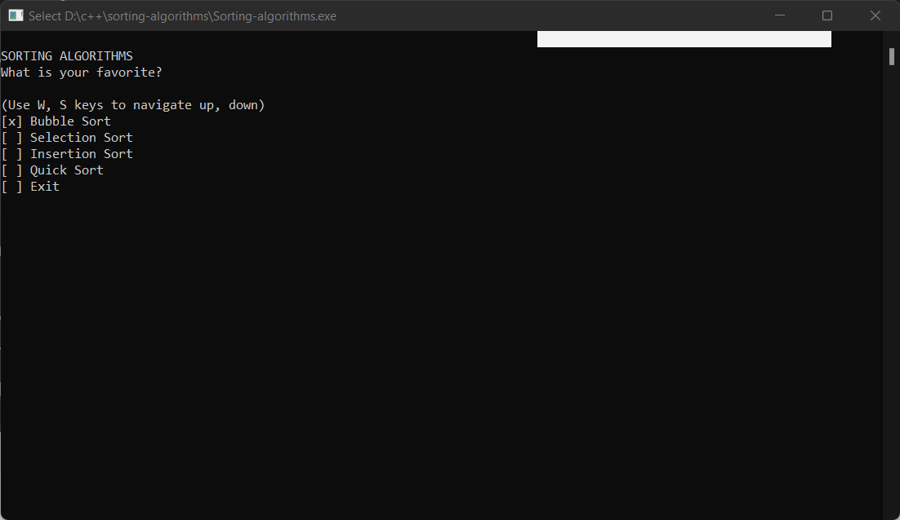
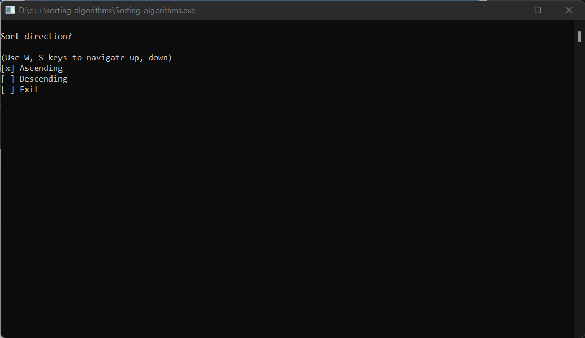
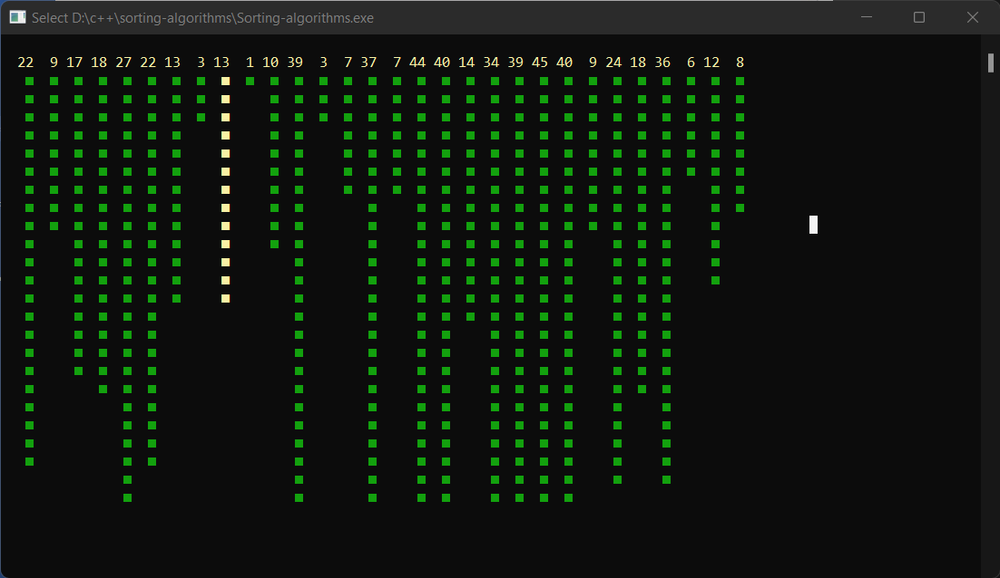

# Sorting algorithms
Repository for learning C/C++

## screen
### Select sorting strategies
pressing w or s to navigate up or down the menu to pick sorting algorithm that you want
 

### Select sorting direction
pressing w or s to navigate up or down the menu to pick sorting direction that you want

### Render sorting process
render sorting

